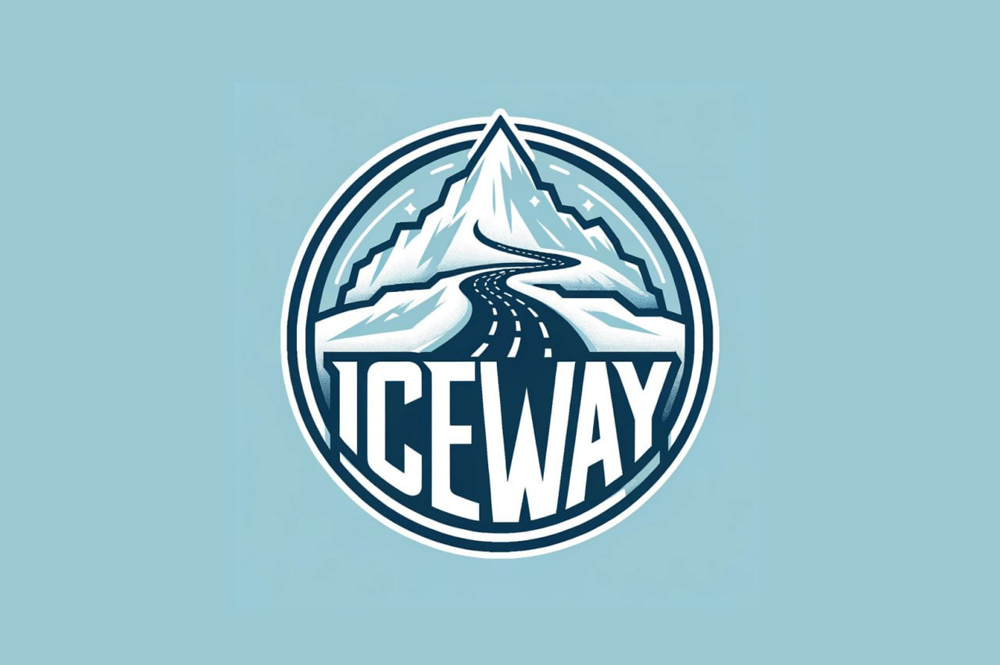
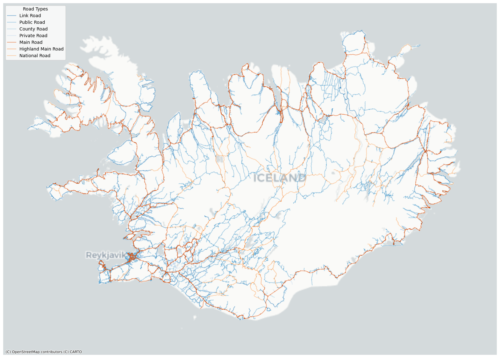

# Rkiskaupas-Datathon

## IceWay



###### IceWay harnesses AI to offer Reykjavik and Iceland an eco-friendly solution for ice-free roads. Driving safer, greener, and smarter.

## Table of Contents
- [Introduction](#introduction)
- [Features](#features)
- [Technologies Used](#technologies-used)
- [Setup and Installation](#setup-and-installation)
- [License](#license)
- [Contact](#contact)

## Introduction

IceWay is a project birthed during the Gagnaþon Ríkiskaupa Datathon, aimed at leveraging AI to forecast road conditions in Reykjavik and across Iceland. By integrating data from various sources including meteorological agencies, Road and Coastal Administration, and city datasets, IceWay provides real-time insights into road conditions, enabling better resource allocation for snow clearing operations and offering travelers crucial information for safe travel.



## Features

- Real-time road condition monitoring and prediction.
- Efficient allocation of snow clearing resources.
- Providing crucial road condition information to the public.
- Reducing operational costs and greenhouse gas emissions through optimized snow clearing operations.

## Technologies Used

- Programming Language: Python
- Framework: NetworkX
- Machine Learning Architecture: Convolutional U-net architecture
- Classification Algorithm: Naive Bayes classifier
- Data Collection APIs: vedur.is, openweathermap.org, gagnaveita.vegagerdin.is
- Other Tools: iceweather python package, XML parsing for real-time traffic cam image acquisition

## Setup and Installation

Detail the steps necessary to get the project up and running. Include commands to clone the repository, install dependencies, and any other necessary instructions.

```bash
# Clone the repository
git clone https://github.com/imtambovtcev/Rkiskaupas-Datathon.git

# Navigate to the project directory
cd Rkiskaupas-Datathon

# Install dependencies
pip install
```

## License

This project is licensed under the MIT License - see the [LICENSE](LICENSE) file for details.

## Contact

For any inquiries or additional information, feel free to contact:

- Ivan Tambovtsev: imtambovtcev@gmail.com